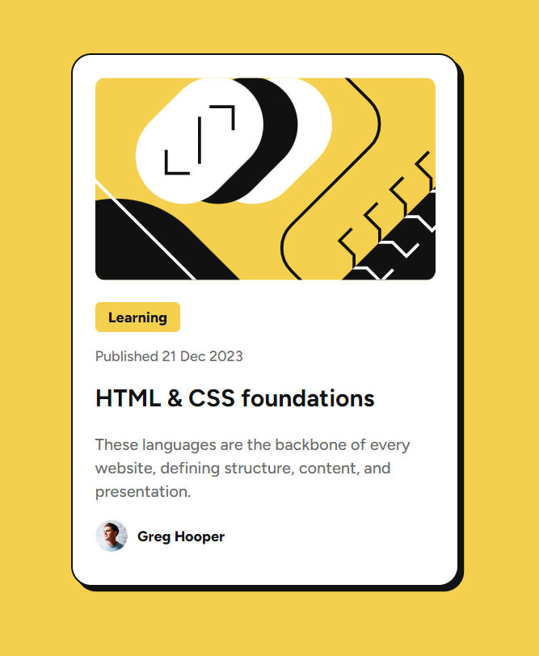

# Frontend Mentor - Blog preview card solution

This is a solution to the [Blog preview card challenge on Frontend Mentor](https://www.frontendmentor.io/challenges/blog-preview-card-ckPaj01IcS). Frontend Mentor challenges help you improve your coding skills by building realistic projects. 

## Table of contents

- [Overview](#overview)
  - [The challenge](#the-challenge)
  - [Screenshot](#screenshot)
  - [Links](#links)
- [My process](#my-process)
  - [Built with](#built-with)

**Note: Delete this note and update the table of contents based on what sections you keep.**

## Overview

### The challenge

Users should be able to:

- See hover and focus states for all interactive elements on the page

### Screenshot

### Links

- Solution URL: [https://github.com/kentimus/frontendmentor-projects/tree/main/blog-preview-card](https://github.com/kentimus/frontendmentor-projects/tree/main/blog-preview-card)
- Live Site URL: [https://kentimus.github.io/frontendmentor-projects/blog-preview-card/index.html](https://kentimus.github.io/frontendmentor-projects/blog-preview-card/index.html)

## My process

### Built with

- HTML5
- CSS 

