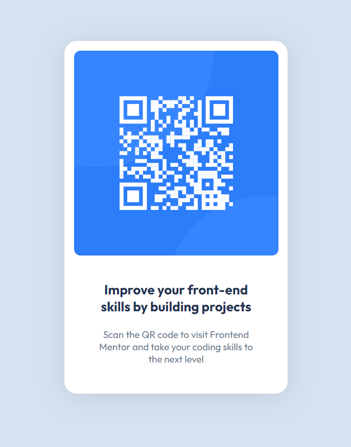

# Frontend Mentor - QR code component solution

This is a solution to the [QR code component challenge on Frontend Mentor](https://www.frontendmentor.io/challenges/qr-code-component-iux_sIO_H). Frontend Mentor challenges help you improve your coding skills by building realistic projects. 

## Table of contents

- [Overview](#overview)
  - [Screenshot](#screenshot)
  - [Links](#links)
- [Author](#author)

**Note: Delete this note and update the table of contents based on what sections you keep.**

## Overview

First project from frontendmentor.io. It is a simple card with a qr code image.

### Screenshot

### Links
- Solution URL: [https://github.com/kentimus/frontendmentor-projects-qr/tree/main/qr-code-component-main] 
- Live Site URL: [https://kentroper.com/frontendmentor-challenges/qr-code-component-main/index.html](https://kentroper.com/frontendmentor-challenges/qr-code-component-main/index.html)

### Built with

- Semantic HTML5 markup
- Flexbox

## Author

- Website - [Kent Rooper](https://kentroper.com/frontendmentor-challenges/)
- Frontend Mentor - [@kentimus](https://www.frontendmentor.io/profile/kentimus)

